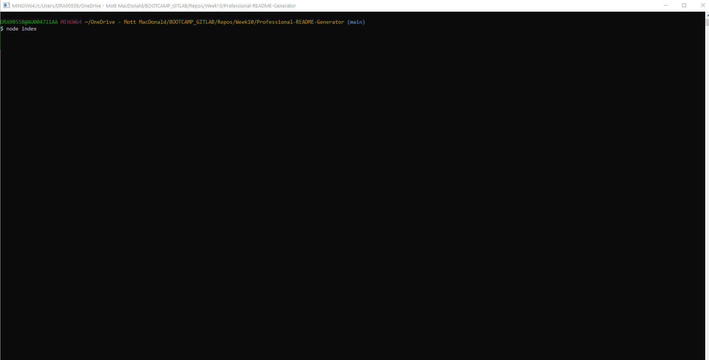

# README Generator with Node.js

<h2>Table of content</h2>

## Table of Contents 
- [Description](#description)
- [Installation](#installation)
- [Usage](#usage)
- [License](#license)
- [Contributing](#contributing)
- [Follow](#follow)

----

## Description

This command-line application dynamically generates a professional README file from a user's input using the [Inquirer package](https://www.npmjs.com/package/inquirer)

The following animation shows the web application's appearance and functionality:

A sample README generated using the application can be found here 
[README test ](./src/README_Test.md) 

----

## Installation

💾   
  
`npm init`
  
`npm install inquirer`

----

## Usage

💻   
  
Run the following command at the root of your project and answer the prompted questions

`node index.js`

🎥  A video of the typical user flow through the application can be found here 
[Professional README Generator.mp4](./src/READMEGenerator.mp4)  

----

## License

This App is covered by the \

----

## Contributing

Fork this repository if you want to contribute\

----

## Follow
\
